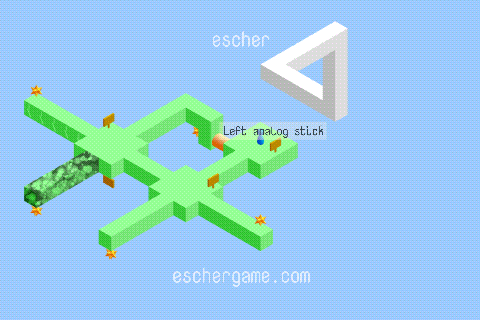
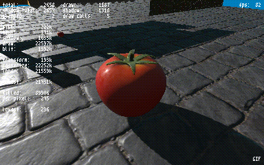
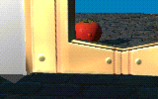
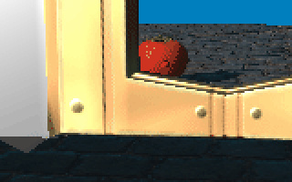

A single-header animated GIF exporter, suitable for recording gifs in realtime.
* **Easy to use**. Single-header C code compiles as C99 or C++98. The only dependency is the C standard library headers. Simple and minimal API.
* **High-quality results**. Uses a straightforward palette selection and dithering algorithm that is guaranteed to provide equal fidelity for all areas of the image, thereby avoiding the artifacts that are typical of the kind of frequency-based adaptive color quantization algorithms used in most gif encoders. See the side-by-side comparison below for an example.
* **Small file sizes**. Uses delta encoding between frames and a compression-friendly dithering kernel, resulting in significantly smaller files than most gif encoders, without sacrificing quality.
* **Fast**. Designed for speed, and uses SSE where available to encode at hundreds of megabytes a second, several times faster than comparable gif libraries.
* **Public domain**. Also available under MIT license. See the bottom of the source file for license text.
* **Actively maintained**. This is not abandonware! If there is a problem or a feature you feel is missing, tell me and there's a good chance I can add it. Or submit a pull request if you're feeling generous - the code is relatively short and simple.

## Examples

[](https://eschergame.com/)

[](https://github.com/notnullnotvoid/DIWide)




Above: a side-by-side comparisons of different color quantization algorithms dealing with a difficult area of an animation. On the left is the constant-quality algorithm used by msf_gif. On the right is an adaptive algorithm with a random dither. The adaptive algorithm struggles to give sufficient quality to the tomato because it's a small portion of the image and therefore gets only a small portion of the color palette. The adaptive algorithm also takes longer to encode, and results in a larger file.

## How to use

In **exactly one** translation unit (.c or .cpp file), `#define MSF_GIF_IMPL` before including the header, like so:
```cpp
#define MSF_GIF_IMPL
#include "msf_gif.h"
```
Everywhere else, just include the header like normal.

### Usage example

```cpp
int width = 480, height = 320, centisecondsPerFrame = 5, bitDepth = 16;
MsfGifState gifState = {};
// msf_gif_bgra_flag = true; //optionally, set this flag if your pixels are in BGRA format instead of RGBA
// msf_gif_alpha_threshold = 128; //optionally, enable transparency (see documentation in header for details)
msf_gif_begin(&gifState, width, height);
msf_gif_frame(&gifState, ..., centisecondsPerFrame, bitDepth, width * 4); //frame 1
msf_gif_frame(&gifState, ..., centisecondsPerFrame, bitDepth, width * 4); //frame 2
msf_gif_frame(&gifState, ..., centisecondsPerFrame, bitDepth, width * 4); //frame 3, etc...
MsfGifResult result = msf_gif_end(&gifState);
if (result.data) {
    FILE * fp = fopen("MyGif.gif", "wb");
    fwrite(result.data, result.dataSize, 1, fp);
    fclose(fp);
}
msf_gif_free(result);
```
Detailed function documentation can be found in the header.

### A note on image resizing

If the data source you're making a gif from is high-resolution, the resulting gif may be prohibitively large and take a long time to export. To make a gif with a smaller resolution, you have a few options:
1. The best option, if capturing a gif directly from a game or other application, is to render the scene a second time to a smaller-resolution texture. This is what I do, but it can be tricky to set up, and could be expensive depending on the scene.
2. The second-best option is to render to a texture and downscale on the GPU. This can be surprisingly tricky to get right, and quality may suffer. You can do your own higher-quality resampling in a compute shader or fragment shader, but that's more difficult.
3. The third-best option, and the easiest, is to downscale on the CPU. For this you can use [stb_image_resize.h](https://github.com/nothings/stb/blob/master/stb_image_resize.h), which provides high-quality results, but can be very slow. I'm currently looking into creating a much faster alternative. Watch this space!
